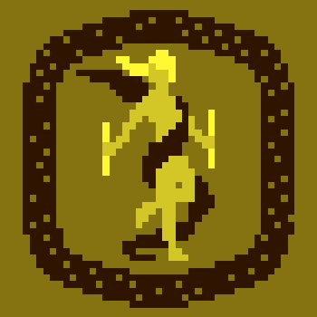

# Digital Arcana

### Introduction

Digital Arcana is a platform born from the love of tarot art and a desire to utilize it in games. While NFTs today are largely focused on one of two avenues, the purely aesthetic or those bound to a particular game or function, our goal is to merge the two into one. We aim to provide great works of art, which have intrinsic value, integrated seamlessly into a platform that provides that art multiple functions.

Players collect cards through acquiring presorted packs. The cards are used for gameplay while at the same time contributing to a player's curated collection. We will work with artists to create and distribute their art as new sets to the community through the platform.

The experience aims to be as diverse as real-world card games, with classic games, experiences generated by the DA team, as well as allowing the use of the card functionality by the community to make their own creations.

### Monetization & Supply

Digital Arcana is an avenue for artists to share their art, but without that art there would be no inspiration for the platform. Because of this, DA's smart contracts provide royalties of all purchases back to artists who mint their decks on the platform.

Art will initially be distributed in packs of seven cards. Cards are minted in multiple lots of differing sizes, thus providing rarity to cards of smaller lots. Packs are sold at random, or optionally with guarantees of including a card of specific rarity for a premium. Games may additionally use a card's assocated rarity for special purposes (e.g. breaking ties in a game of War).

Because each card is an NFT, you own them, and can resell them on marketplaces such as [objkt.com](http://objkt.com). In the future, we will enable user currated packs which can be resold as a set.

Digital Arcana is built on [Tezos](https://tezos.com/). This keeps transaction fees low, and the environment happy.

We hope you enjoy DA as much as we do making it!
