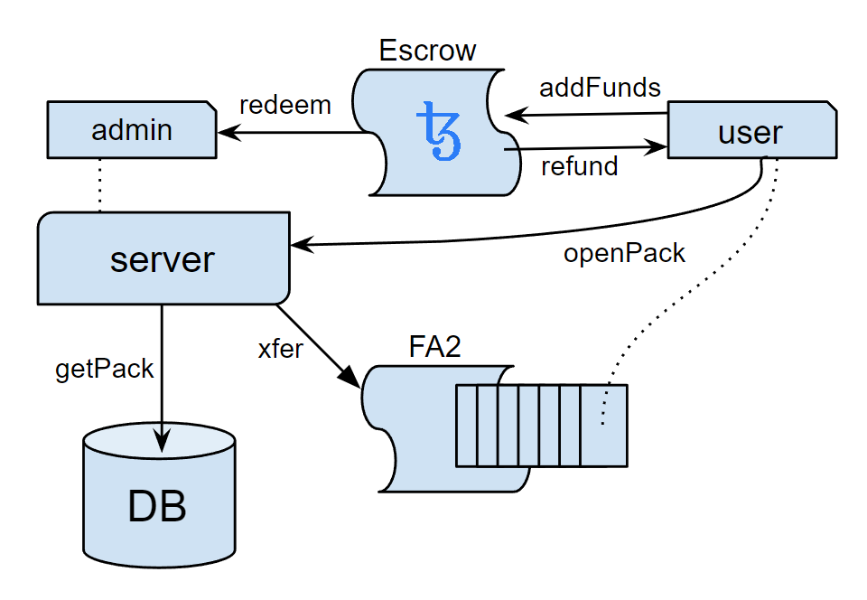

# Digital Arcana

**Working prototype:** https://digitalarcana.xyz/

**Overview:** https://youtu.be/AxaY7xbLZLU

### Introduction

Digital Arcana is a platform born from the love of tarot art and a desire to utilize it in games.  Providing distraction in turbulent times, teaching rule-based learning principles, and fostering competition in a structured environment are just a few of the great aspects of games.  They even channel conflict in constructive directions and foster creativity.

Today, NFTs are largely focused on one of two avenues, the purely aesthetic or those bound to a particular game or function. Our goal is to merge the two into one. Art alone has intrinsic value and we aim to provide it utility as well by integrating it seamlessly across all games on a unified platform.

Players collect art as cards through acquiring presorted packs. The cards are used for gameplay while at the same time contributing to a player's curated collection. We will work with artists to create and distribute their art as new sets to the community through the platform.

The experience aims to be as diverse as real-world card games, with classic games, experiences generated by the DA team, and content from the community.

### Monetization & Supply

Digital Arcana is an avenue for artists to share their art, but without that art there would be no inspiration for the platform. Because of this, DA's smart contracts provide royalties of all purchases back to artists who mint their decks on the platform.

Art will initially be distributed in packs of seven cards. Cards are minted in multiple lots of differing sizes, thus providing rarity to cards of smaller lots. Packs are sold at random, or optionally with guarantees of including a card of specific rarity for a premium. Games may additionally use a card's assocated rarity for special purposes (e.g. breaking ties in a game of War).

Because each card is an NFT, you own them, and can resell them on marketplaces such as [objkt.com](http://objkt.com). In the future, we will enable user currated packs which can be resold as a set.

Digital Arcana is built on [Tezos](https://tezos.com/). This keeps transaction fees low, and the environment happy.

We hope you enjoy DA as much as we do making it!

### Contracts

#### FA2
- https://better-call.dev/hangzhou2net/KT1N1a7TA1rEedQo2pEQXhuVgSQNvgRWKkdJ
- https://better-call.dev/ithacanet/KT19r4jkRtopWqEVVSqyvuSYQ7Z73vPQdfGT
- SmartPy: https://github.com/a-digitalarcana/app/blob/main/python/contracts/fa2.py

#### Escrow
- https://better-call.dev/hangzhou2net/KT1WZY4nrsHbQn6VHX6Ny1X1LYcPb7mss9iK
- https://better-call.dev/ithacanet/KT19r4jkRtopWqEVVSqyvuSYQ7Z73vPQdfGT
- SmartPy: https://github.com/a-digitalarcana/app/blob/main/python/contracts/escrow.py

To avoid revealing cards before they are purchased, we use an escrow contract. Users can add and remove funds, which can be redeemed for card packs. A future implementation might use [tickets](python/contracts/tickets.py) which would allow purchased, unopened packs to be traded, resold, or gifted. Opening a card pack consists of redeeming the escrowed funds and transferring the set of cards to the user in a single atomic transaction on the Tezos network.  This operation is initated by the server at the user's request, and signed by an administration account with operator permission to perform the transaction.  Choosing the set of cards is up to the server, selecting randomly from the available, pre-sorted packs.  This provides the freedom to enable special sales (e.g. guaranteeing a card of a specific rarity), and prevents the set of cards from being exposed before funds have been commited by the purchaser.

